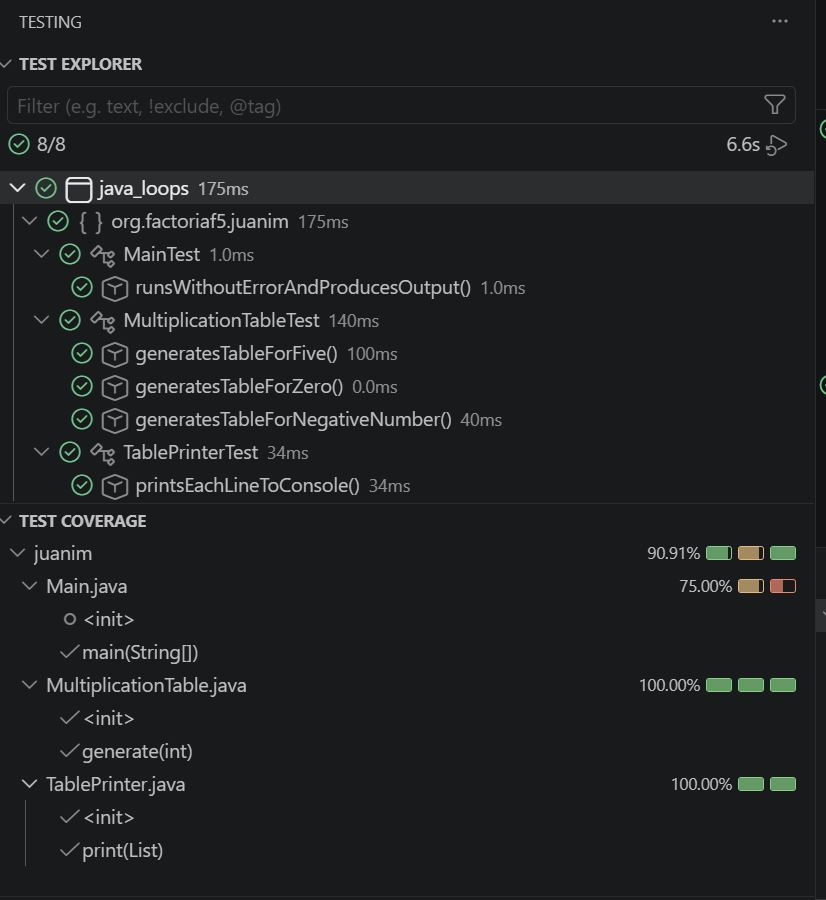
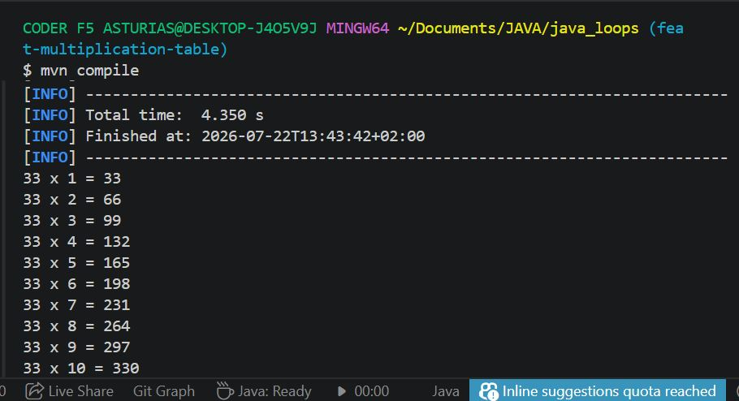
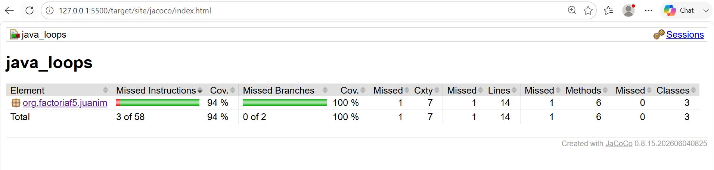

# Tabla de Multiplicar

Ejercicio en Java que genera la tabla de multiplicar de un número entero (del 1 al 10), aplicando separación de responsabilidades (SRP) y testeado con JUnit 5 y JaCoCo.

## Descripción

Dado un número entero `n`, el programa genera su tabla de multiplicar en el formato `n x i = resultado`. Por ejemplo, para `n = 5`:

```
5 x 1 = 5
5 x 2 = 10
5 x 3 = 15
5 x 4 = 20
5 x 5 = 25
5 x 6 = 30
5 x 7 = 35
5 x 8 = 40
5 x 9 = 45
5 x 10 = 50

```

## Estructura y diseño

El proyecto aplica el principio de **responsabilidad única (SRP)** repartiendo el trabajo en tres clases:

- **`MultiplicationTable`** — genera la tabla y devuelve los datos (lógica).
- **`TablePrinter`** — muestra la tabla por consola (presentación).
- **`Main`** — orquesta: crea las piezas y las conecta.

## Tecnologías

- Java 21
- Maven
- JUnit 5
- JaCoCo (cobertura)

## Cómo ejecutar

Ejecutar el programa:

```bash
mvn compile exec:java -Dexec.mainClass="org.factoriaf5.juanim.Main"
```

O compilar y lanzar los tests:

```bash
mvn clean test
```

## Testing

El proyecto incluye una clase de test por cada clase de producción, cubriendo el escenario normal y otros adicionales (caso normal y casos borde), en este caso, con el 0 y valores negativos.

Panel de testing en VS Code con todos los tests en verde:



Prueba de imprimación en consola con otra cifra (33):





## Cobertura

La cobertura de tests se mide con JaCoCo. El informe se genera en `target/site/jacoco/index.html` tras ejecutar `mvn clean test`.

Cobertura obtenida: **94%** (requisito mínimo: 70%).

